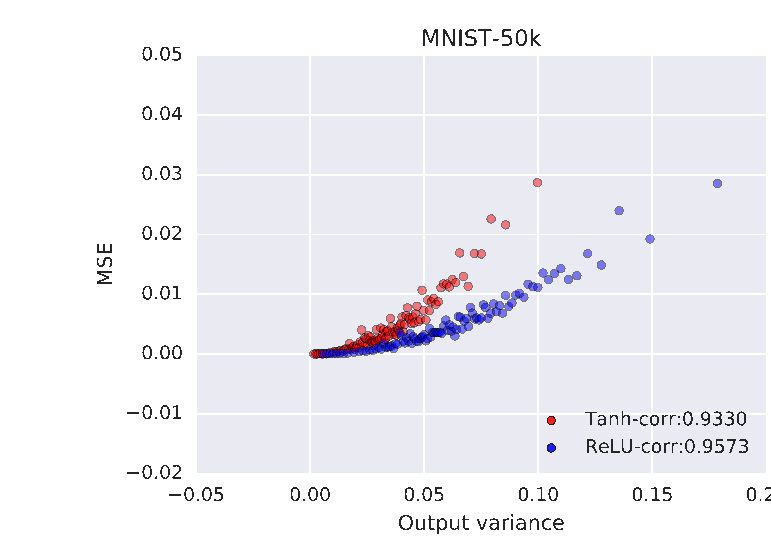
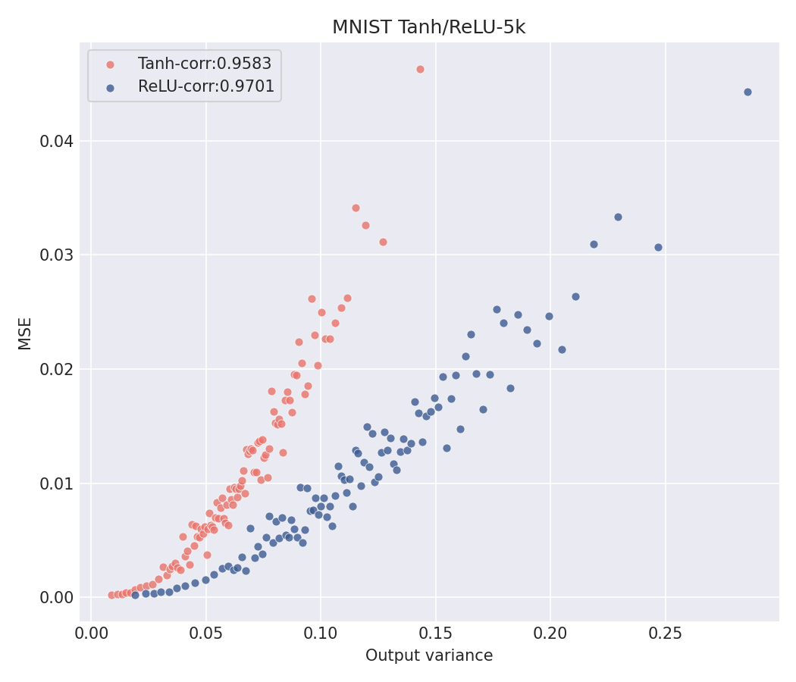
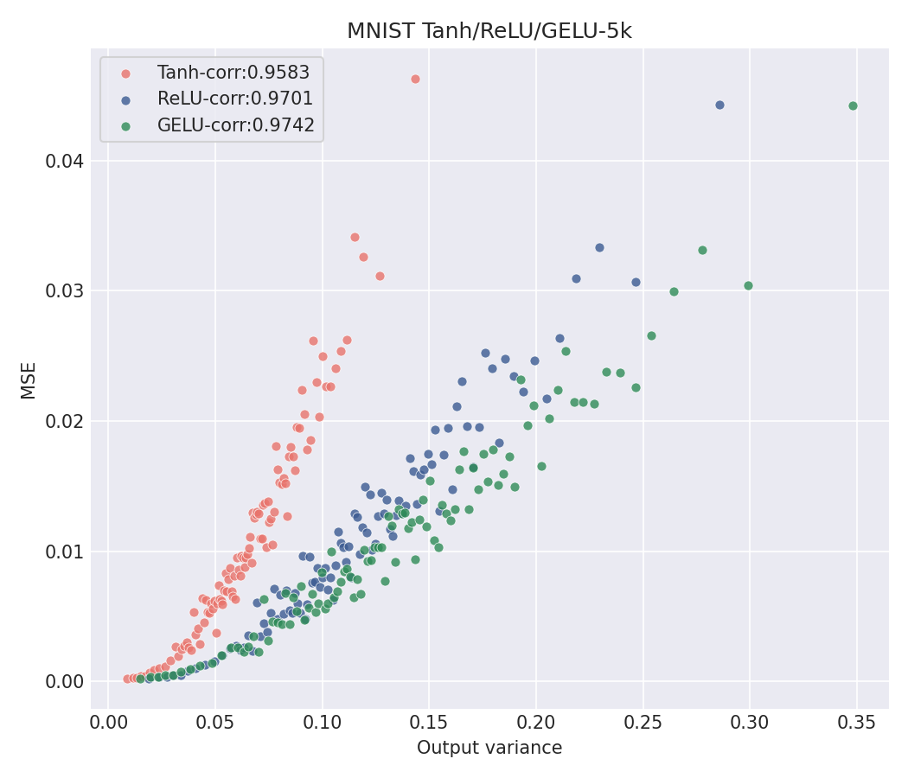
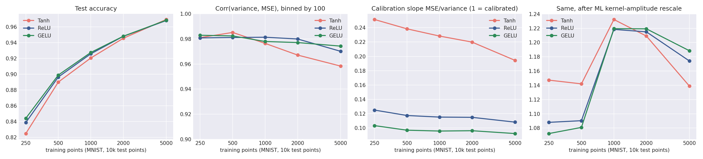
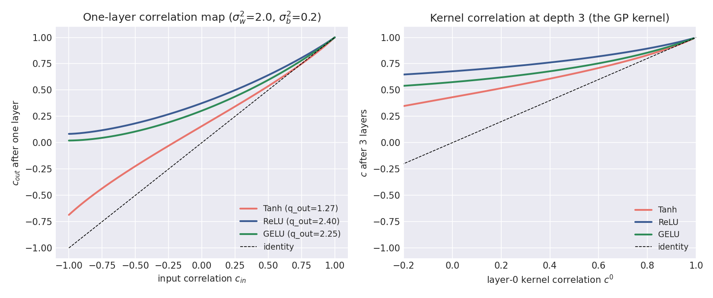

# NNGP Project 2: Reproducing Figure 3 and Extending It to GELU

APPM 5750, Fall 2026. Atharva Zodpe.

This repository reproduces **Figure 3** of *Deep Neural Networks as Gaussian Processes* (Lee, Bahri, Novak, Schoenholz, Pennington & Sohl-Dickstein, ICLR 2018, [arXiv:1711.00165](https://arxiv.org/abs/1711.00165)). Figure 3 shows that the NNGP's predictive variance tracks its real test error. The repo then extends that analysis to an activation the paper never tested, **GELU**. Everything runs inside one Docker image.

The code builds directly on the official release, [github.com/brain-research/nngp](https://github.com/brain-research/nngp) (Apache 2.0). The original README is kept as [`README_original_nngp.md`](README_original_nngp.md).

---

## 1. Quick start (clean-clone test)

```bash
git clone https://github.com/aazodpe/APPM-5750-Project-2.git
cd APPM-5750-Project-2
docker build -t nngp-project .
docker run nngp-project
```

On a 2-core machine the build takes about 1 minute and the default `all` run takes roughly 10–15 minutes (most of it in the 10,000-test-point posterior solves; it was 12 minutes on the Windows/WSL2 machine used for the clean-clone test). The run prints every metric to the terminal. The figures are written to `/nngp/output` **inside** the container. To copy them to your own machine, mount a folder:

| Shell | Command |
|---|---|
| macOS / Linux | `docker run -v "$(pwd)/output":/nngp/output nngp-project` |
| Windows PowerShell | `docker run -v "${PWD}/output:/nngp/output" nngp-project` |

The same figures from our run are already committed in [`results/`](results/), so you can compare without running anything.

Other modes (the first argument after the image name):

| Command | What it does | Time |
|---|---|---|
| `docker run nngp-project` (= `all`) | Figure 3 reproduction, then the GELU extension sweep | ~12 min |
| `docker run nngp-project fig3` | Figure 3 only (tanh, ReLU and GELU at 5k training points) | ~7 min |
| `docker run nngp-project extension` | Extension sweep only | ~5 min |
| `docker run nngp-project validate` | Correctness checks for the kernel lookup grids (Section 4.3) | ~1 min |
| `docker run nngp-project --num_train=1000 --nonlinearities=relu ...` | Any flags are passed straight to `uncertainty_plot.py` | varies |
| `docker run -e NUM_TRAIN=10000 nngp-project fig3` | Larger training set (needs about 4 GB of RAM for Docker) | longer |

**Requirements:** Docker Desktop (or Docker Engine) and about 3 GB of disk. No Python setup and no internet access at run time, because MNIST is included in the repo. The base image only exists for amd64, so the Dockerfile pins `--platform=linux/amd64`. On Apple-silicon Macs it runs under emulation, which is slower.

---

## 2. Target figure: side-by-side comparison

**Figure 3 (paper):** *"The Bayesian nature of NNGP allows it to assign a prediction uncertainty to each test point. This prediction uncertainty is highly correlated with the empirical error on test points. [...] each plotted point is an average over 100 test points, binned by predicted MSE. The hyperparameters for the NNGP are depth=3, σ_w²=2.0, and σ_b²=0.2."*

| Original (Lee et al. 2018, Fig. 3, MNIST panel) | This reproduction (MNIST, 5k train, 10k test) |
|---|---|
|  |  |

| | Paper (MNIST-50k) | Ours (MNIST-5k) |
|---|---|---|
| Tanh corr. (binned) | 0.9330 | **0.9583** |
| ReLU corr. (binned) | 0.9573 | **0.9701** |
| Test accuracy (tanh / ReLU) | not reported | 96.9% / 96.8% |

The paper's legend values are read off the MNIST-50k panel of Figure 3 (the
CIFAR-45k panel reports 0.7428 / 0.8223). The full two-panel crop is kept as
[`figures/paper_fig3_both_panels.png`](figures/paper_fig3_both_panels.png).

**Result.** The paper's claim reproduces. For both activations the binned predicted variance and the binned realized MSE are strongly and monotonically related, and our correlations land slightly *above* the paper's (0.958 vs. 0.933 for tanh, 0.970 vs. 0.957 for ReLU). We read the small gap as a consequence of the smaller training set rather than a discrepancy: with 5k training points the predicted variances are larger and spread over a wider range, which spaces the 100-point bins out and makes the trend easier to fit. The qualitative structure is the same as the paper's panel. Points with low predicted variance are almost always classified correctly, and the highest-variance bins hold most of the error. As in the paper, ReLU produces larger variances than tanh at the same hyperparameters, so its points spread further along the x-axis, and both panels show the same upward-curving, fan-shaped envelope.

### How the code maps to the paper

`uncertainty_plot.py` has comments at each step pointing to the relevant part of the paper:

| Step | Paper | Code |
|---|---|---|
| One-hot, zero-mean targets (0.9 / −0.1) | Sec. 3.1 | `load_data()` → `load_dataset.load_mnist(mean_subtraction=True)` |
| Kernel recursion K^l = σ_b² + σ_w² F_φ(K^{l−1}) | Sec. 2.3, Eq. 4–5 | `nngp.NNGPKernel.k_full / k_diag` |
| F_φ from a precomputed (variance, correlation) lookup grid | Sec. 2.5 | `grid_data/`, `interp.py`, our `make_grid.py` |
| GP posterior mean / variance | Sec. 2.4, Eq. 8–9 | `gpr.GaussianProcessRegression.predict(get_var=True)` |
| Per-point predicted MSE vs. realized MSE, bins of 100 | Fig. 3 caption | `compute_uncertainty_and_error`, `bin_by_predicted_mse` |

---

## 3. What we changed or added

| File | Status | Purpose |
|---|---|---|
| `Dockerfile` | extended from the in-class base | Pinned deps, CRLF fix, bundled MNIST, build-time import check, GELU grid fallback |
| `run_all.sh` | new | Container entry point (modes above) and summary table |
| `uncertainty_plot.py` | extended from the in-class version | Paper cross-references, GELU support, accuracy/calibration metrics, CSV output, zero-mean CIFAR labels |
| `activations.py` | new | Named GELU activation for the kernel (nngp.py names grid files after `fn.__name__`) |
| `make_grid.py` | new | Memory-safe NumPy builder for the Sec. 2.5 lookup grid, plus `--validate` |
| `grid_data/grid_gelu_*` | new (generated) | GELU lookup grid, built by `make_grid.py` |
| `extension_gelu.py` | new | Extension experiments and figures |
| `data/mnist/*.gz` | new (bundled) | The standard MNIST files, so the run needs no download |
| `.gitattributes`, `.dockerignore`, `.gitignore` | new | Reproducibility hygiene (see Section 6) |

The environment fixes from class are unchanged: `xrange` → `range`, and `np.load(..., allow_pickle=True, encoding='latin1')`.

---

## 4. Unique extension: a GELU kernel

### 4.1 What we did, why, and what we found

The paper tests only two activations, tanh and ReLU. Since then, **GELU** (φ(x) = x·Φ(x), where Φ is the Gaussian CDF) has become the default activation in transformers. That makes it a natural question for Figure 3: does the NNGP's "uncertainty tracks error" property depend on the activation, or is it a general feature of the Bayesian posterior? GELU is a useful test case: it behaves like ReLU for large |x| but is smooth and non-monotonic near zero, and it has no simple closed-form kernel, so the numerical-integration route in Sec. 2.5 is actually needed.

**Implementation.** The kernel code in `nngp.py` accepts any φ, but only once a lookup table of E[φ(z₁)φ(z₂)] exists over (variance, correlation). The repo's own table builder allocates about 1 GB per variance row on every CPU core, which crashes a normal Docker VM, so we wrote `make_grid.py` to compute the same quadrature in small NumPy chunks and write the same file format. We checked it three ways before trusting it with GELU (Section 4.3): it regenerates the shipped tanh and ReLU tables to within 5×10⁻¹², matches ReLU's exact arc-cosine kernel, and agrees with Monte-Carlo estimates for GELU. We then reran the Figure 3 pipeline with φ = GELU at the paper's hyperparameters (depth 3, σ_w² = 2.0, σ_b² = 0.2), sweeping the number of training points from 250 to 5,000 for all three activations.

**Findings.**
1. **The Figure 3 result holds for GELU.** The binned correlation is 0.974 at 5k training points, slightly higher than ReLU (0.970) and tanh (0.958). It stays between 0.97 and 0.98 across the whole sweep ([`results/fig3_mnist_tanh_relu_gelu.png`](results/fig3_mnist_tanh_relu_gelu.png), [`results/ext_sweep.png`](results/ext_sweep.png)). Test accuracy is essentially the same as ReLU at every size (96.9% at 5k), and slightly ahead of tanh when training data is small.
2. **Correlated does not mean calibrated.** The raw predicted variance overestimates the real MSE by about 5× for tanh, 9× for ReLU and 11× for GELU. The paper only claims correlation, and our figure shows why: the kernel's scale comes from σ_w² and σ_b², not from the labels. Fitting one kernel amplitude by maximum likelihood (a = tᵀK⁻¹t / n, no extra computation) brings the slope of MSE against variance to about 1.1–1.2 for **all three** activations. So the activations differ mostly in kernel *scale*, not in how well their uncertainty ranks the test points.
3. **Why GELU sits between tanh and ReLU.** [`results/ext_cmap.png`](results/ext_cmap.png) plots the layer-to-layer correlation map from Sec. 3.2 of the paper. GELU's map is close to ReLU's but maps dissimilar inputs to lower correlations, so after three layers its kernel is less "washed out" than ReLU's while keeping ReLU's scale growth. That matches its ReLU-like accuracy and its slightly better uncertainty ranking.

**Takeaway.** The NNGP's uncertainty-error correlation is robust to the activation choice, including one that is smooth and non-monotonic. Its absolute scale is not, and a one-parameter amplitude fit is enough to make the variance a usable error estimate.

### 4.2 Extension figures

| Figure 3 with GELU | Accuracy / correlation / calibration vs. training size |
|---|---|
|  |  |



Raw numbers: [`results/fig3_metrics.csv`](results/fig3_metrics.csv), [`results/ext_metrics.csv`](results/ext_metrics.csv).

### 4.3 How we tested the new code

`docker run nngp-project validate` runs all three checks:

```
[validate] relu  max|our - shipped|: q_aa 1.95e-14   q_ab 5.12e-12
[validate] tanh  max|our - shipped|: q_aa 1.67e-15   q_ab 3.59e-14
[validate] relu vs closed-form arc-cosine kernel (v <= 5): max relative error 1.22e-04
[validate] gelu grid q_ab(v=2.0, c=+0.603) = 0.58472   MC = 0.58472   |z| = 0.00
...
[validate] PASSED
```

Along the way we found a limitation of the original code. The quadrature grid in `nngp.py` is fixed to z ∈ [−10, 10] no matter what the variance is, so for pre-activation variances above about 10 the Gaussian tails get cut off. ReLU's error against the exact kernel rises to 1% at v = 10 and 9% at v = 20. At the Figure 3 hyperparameters the variances stay around 1–3, so our results are unaffected, but deep or large-σ_w² settings would be.

---

## 5. Known limitations and deviations from the paper

- **Training-set size: 5,000 instead of 50,000 (MNIST).** Exact GP regression needs the full n×n kernel. At 50k that is 20 GB in float64, which is more than a laptop Docker VM has. At 5k it is about 200 MB and the run takes minutes. Use `-e NUM_TRAIN=...` to go larger if you have the memory. Correlations are computed over all 10,000 MNIST test points (100 bins of 100, as in the caption).
- **MNIST only by default.** The paper's figure also has a CIFAR-10 panel. `uncertainty_plot.py --dataset=cifar10` supports it, but it downloads about 170 MB at run time, so it is not part of the default clean-clone run. Unlike the in-class loader, it uses the paper's zero-mean one-hot labels.
- **No hyperparameter search.** We use the caption's fixed values (depth 3, σ_w² 2.0, σ_b² 0.2) for every activation, including GELU. They may not be optimal for GELU.
- **"Predicted MSE"** is the latent GP variance from Eq. 9, with the tiny numerical jitter (1e-10) as the only noise term. This matches the original code.
- **Single data subset.** Class-balanced, fixed seed, as in `load_dataset.py`. There are no error bars across seeds.
- **Base image.** `tensorflow/tensorflow:1.15.0-py3` (Python 3.6) is referenced by tag, not by digest. Python packages we add are pinned.

---

## 6. Reproducibility notes (what could break, and what we did about it)

| Risk | Mitigation |
|---|---|
| Python 2 code (`xrange`) | `sed` fix in the Dockerfile (from class) |
| numpy refuses pickled grid files | `allow_pickle=True, encoding='latin1'` patch (from class) |
| MNIST download host changes or no network | The four standard MNIST `.gz` files are bundled in `data/mnist/` and copied to the loader's cache path at build time |
| Windows clone turns `run_all.sh` into CRLF → `bash: $'\r'` errors | `.gitattributes` forces LF, and the Dockerfile also strips `\r` |
| Apple-silicon Mac pulls no image (amd64 only) | `FROM --platform=linux/amd64` |
| New package releases break the build | matplotlib and its dependencies pinned to their last Python 3.6 versions |
| Missing GELU grid | Shipped in `grid_data/`. If deleted, the Docker build regenerates it with `make_grid.py` |
| Outputs "disappear" (they stay inside the container) | Printed summary, `-v` instructions, committed `results/` |

**Testing:** the full `git clone` → `docker build --no-cache` → `docker run` sequence was run from a fresh clone into an empty directory (Docker 29.8.1, Windows 11 / WSL2 backend, amd64). Build and run both exited 0, and every number the container produced matched the committed `results/*.csv` exactly — tanh 0.958335, ReLU 0.970112, GELU 0.974237, and all 15 rows of the sweep. *Still to do: have a classmate run the same sequence on their machine, as suggested in lecture.*

---

## 7. Development process and LLM use

The extension was pair-programmed with Claude (Anthropic) as the "driver", following the lecture's recommendation. [`PROMPTS.md`](PROMPTS.md) logs the prompts, what the LLM generated, and what was checked or changed.

## 8. References

- J. Lee, Y. Bahri, R. Novak, S. S. Schoenholz, J. Pennington, J. Sohl-Dickstein. *Deep Neural Networks as Gaussian Processes.* ICLR 2018. [arXiv:1711.00165](https://arxiv.org/abs/1711.00165)
- Original code: [github.com/brain-research/nngp](https://github.com/brain-research/nngp) (Apache 2.0)
- D. Hendrycks, K. Gimpel. *Gaussian Error Linear Units (GELUs).* 2016. [arXiv:1606.08415](https://arxiv.org/abs/1606.08415)
- Y. Cho, L. Saul. *Kernel Methods for Deep Learning.* NeurIPS 2009 (arc-cosine / ReLU kernel)
- B. Poole et al. *Exponential expressivity in deep neural networks through transient chaos.* NeurIPS 2016; S. Schoenholz et al. *Deep Information Propagation.* ICLR 2017 (correlation maps)
- Class materials: APPM 5750 Lecture 9 and the in-class base Dockerfile and `uncertainty_plot.py` (R. Cox)
